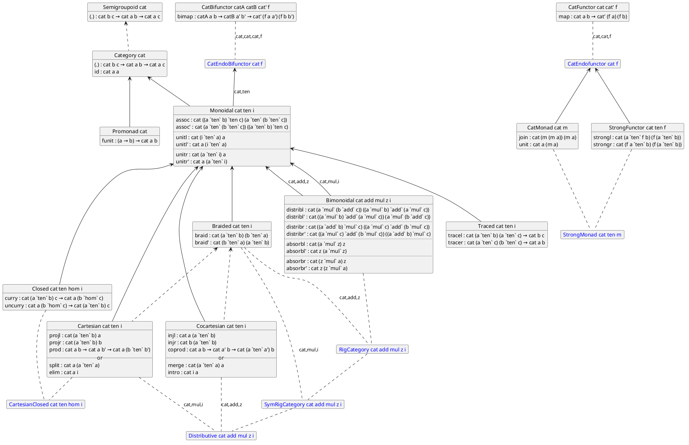

# `cats-and-arrows`: Categorical Effect Systems

> [!WARNING]
> This library is currently half-implemented and in an **extremely** unstable
> state. Depend on it at your own risk.

## To-Do List

- [X] Basic monoidal category interfaces
- [X] Record-style wrapper types
- [ ] Characterization functions for various transforms:
  - [X] Rearranging/"Swizzling" (cartesian monoidal categories)
  - [ ] Permuting (symmetric monoidal categories)
  - [X] Reassociating (monoidal categories)
  - [ ] Factoring/Expanding (bimonoidal categories)
- [ ] Extended features:
  - [X] Traced monoidal categories
  - [X] Strong monads
  - [ ] Isomorphisms
  - [ ] Equivalence of categories
  - [ ] Adjunctions
  - [ ] Enriched categories
  - [ ] Split left- and right- definitions on tensor products
        (as part of better support for non-braided categories)
- [ ] Instances of categories:
  - [X] Category of types and functions
  - [X] Category of types and linear functions
  - [X] Category of categories
  - [X] Functor categories
  - [X] Generalized Kleisli categories
  - [ ] Co-Kleisli categories
  - [ ] Eilenberg-Moore categories
  - [ ] Free category constructions
- [ ] Macro for string diagram notation (if possible)
- [ ] Optimize performance

## What is this?

### For people familiar with category theory

This library is an attempt to introduce [string diagrams] as an intuitive model
of effectful computation, suitable for general-purpose programming. To this end,
it defines interfaces for various flavors of [monoidal category][monoidal
categories], along with convenient utilities for composing diagrams within them.

Unlike prior attempts at using categorical models of computation to implement
effect systems (the two primary examples being [monads] and [arrows]), string
diagrams completely decouple the internal model from the external type system,
allowing for far more flexibility. String diagram notation can be used to model
effectively any DSL, as long as it contains some notion of morphism composition.

> [!NOTE]
> In the interest of being as practically usable as possible, no coherence laws
> are enforced in any of our definitions. If your goal is to formally verify
> results in category theory, this library isn't a good fit for that.

### For people familiar with Haskell's arrows

This library uses category theory and dependent types as a foundation to
massively generalize Haskell's [arrow hierarchy][arrows], adding several
intermediate interfaces to model more general effectful functions.

For context, here's the traditional arrow hierarchy:

```
Category <-- Arrow <-- ArrowChoice
```

And here's the (simplified) `cats-and-arrows` categorical hierarchy:

```
Semigroupoid <-- Category <-- Monoidal <-- Braided <-- Cartesian
                                                           ^
                                                           |
                                            Promonad <-- Arrow <-- ArrowChoice
```

The full hierarchy diagram is below.

A particular benefit of this arrangement is that it lifts the restriction that
arrows must embed regular functions. That requirement is sequestered into the
`Promonad` interface; all other interfaces can be used with categories that have
no relation to ordinary functions. In fact, they don't even have to be defined
on types! Effectively any DSL can be represented with these interfaces.

### For anyone else

This library establishes a new interface for programming with effects, similar
to the well-known system of [monads], but far more general and applicable to
more cases.

Instead of the primary object of the interface being a wrapped type (`m : Type
-> Type`), the primary object of this new system is a generalized function type,
traditionally called a *category* (`cat : obj -> obj -> Type`). You may have
heard of category theory as the mathematical field that monads originate from;
this library pulls from a different area of category theory, specifically the
theory of [monoidal categories]. 

## Usage

Install using [pack](https://github.com/stefan-hoeck/idris2-pack):

```sh
pack install cats-and-arrows
```

### Interface Style

The primary way to use this library is through its interface hierarchy, like
with most other effect-system libraries. Interface definitions are found in
`Control.Category`, which is a re-export of the various `Control.Category.*`
modules.

Normally with sub-interfaces in Idris, the parent interface must be implemented
before a sub-interface implementation can be defined. This can be quite
cumbersome for large interface hierarchies like this one, so where possible this
library instead defines *indirect sub-interfaces*, where the two interfaces are
linked via a named implementation rather than a sub-interface relationship.

For example, the `Cartesian` interface is a direct sub-interface of `Monoidal`,
meaning that a `Monoidal` implementation is required when defining it. However,
it is only an *indirect* sub-interface of `Braided`, meaning that that interface
is not required. Instead, an implementation can be converted using
`Braided.FromCartesian`:

```idris
Braided.FromCartesian : Cartesian cat ten i => Braided cat ten i
```

You can also use this as an easy way to define implementations for a particular
category using `%hint`:

```idris
Cartesian MyCategory MyTensor MyUnit where
  ...

%hint
MyCategoryBraided : Braided MyCategory MyTensor MyUnit
MyCategoryBraided = FromCartesian
```

### Record Style

Sometimes, if the category you're working with has a particularly complex
definition, Idris's interface resolution can break down or become harder to work
with. For this reason, we provide an alternative *record-style* system for
accessing these definitions, which can be found in `Control.Category.Records`.

The record version of an interface is determined by appending an `R` to the
interface name. To construct a record-style category, the interface parameters
are passed in to the constructor, and the interface implementation is
automatically searched for. As an example:

```idris
MorphismCat : CategoryR
MorphismCat = MkCategoryR Morphism
```

The implementation can also be specified with the `impl` implicit argument.

Once a record-style category is constructed, its interface methods can be
accessed with postfix projection functions. The `(.impl)` projection can also be
used to extract the interface implementation to pass into interface-style
functions.

> [!IMPORTANT]
> If you write a function that takes in a record-style category and you notice
> that its fields aren't unifying when they should be, this may be due to Idris2
> not currently having eta-expansion. Pattern-matching on the record might help
> the type-checker unify things properly:
>
> ```idris
> func cat@(MkCategoryR {}) = ...
> ```

## Tutorial

*A more in-depth tutorial on string diagram notation is coming soon!*

## Interface Hierarchy

In this diagram:

- Solid arrows represent direct sub-interfaces
- Dashed arrows represent indirect sub-interfaces
- Blue text denotes synonyms for interface combinations



Note that this diagram is (still) slightly simplified. The compatibility
definitions in `Control.Arrow` are left out for space, as are the synonyms like
`PreMonoidal` used to distinguish [premonoidal categories] (see
[here](docs/CategoricalSins.md) for more information on that).

<!-- Link References -->

[string diagrams]: https://ncatlab.org/nlab/show/string+diagram 
[monoidal categories]: https://ncatlab.org/nlab/show/monoidal+category
[premonoidal categories]: https://ncatlab.org/nlab/show/premonoidal+category
[monads]: https://hackage-content.haskell.org/package/base/docs/Prelude.html#t:Monad
[arrows]: https://www.haskell.org/arrows/index.html
