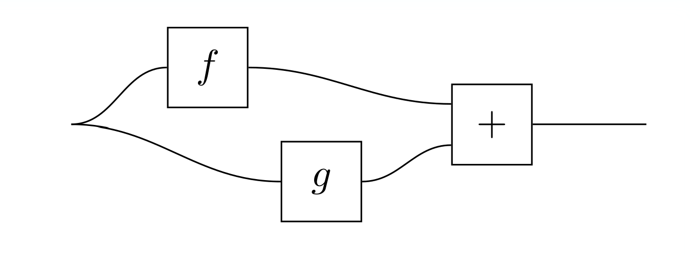
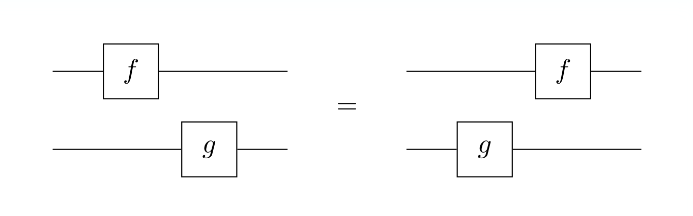

# The Categorical Sins of `cats-and-arrows`
### or; What is a Premonoidal Category?

If you are already familiar with category theory, and in particular the theory
of monoidal categories, you may be a bit confused by the `PreMonoidal`
interface.  After all, it's nothing but a synonym for `Monoidal`:

```idris
PreMonoidal : (cat : Hom obj) -> (ten : obj -> obj -> obj) -> (i : obj) -> Type
PreMonoidal = Monoidal
```

These two names are entirely interchangable. Same for `PreBraided`,
`PreCartesian`, and so on. Why do these pre-definitions exist, if they're just
the same as the regular definition?

The answer is that this is a compromise surrounding an extremely annoying quirk
of computational category theory. Hopefully, by the end of this page, you'll
have a better understanding of when you should care about the difference.

## Background

To understand what a premonoidal category is, we have to start with the
computational model that predates this library and inspired it, that being
*arrows*:

```idris
interface Arrow arr where
  arrow : (a -> b) -> arr a b
  (>>>) : arr a b -> arr b c -> arr a c
  
  first : arr a b -> arr (a, c) (b, c)
  (***) : arr a b -> arr a' b' -> arr (a, a') (b, b')
```

(This is a simplified definition, but it's equivalent to the full version.)

An arrow is a special kind of category whose objects are types. In particular,
arrows can embed ordinary functions within themselves, and are able to act
functorially on pairs. In Haskell, where arrows originated from, a special
syntax called *arrow notation* can be used to construct complex arrow values.
Here's an example from the [Haskell
website](https://www.haskell.org/arrows/syntax.html) that composes two arrows in
parallel and adds their outputs:

```haskell
addA :: Arrow a => a b Int -> a b Int -> a b Int
addA f g = proc x -> do
                y <- f -< x
                z <- g -< x
                returnA -< y + z
```

Arrows are very interesting, but they have some flaws that hinder their general
usability, the main one being that their requirements are far too strict. The
requirement of embedding *any function* is sufficient to enable this notation,
but it is by no means necessary.

The idea for this library came from noticing a similarity between this arrow
notation and the much more general string diagrams used in monoidal category
theory. As an example, the above Haskell function might be written as a string
diagram like this:



Monoidal categories are a far more general setting to work with than arrows, and
taking them as the primitive concept instead enables some interesting
possibilities that arrows could never support.
 
Given that background, the path forward seems pretty straightforward. We just
need to define monoidal categories as an interface, convert string diagrams into
a notation that can be written in Idris, and then we can have these arrows be a
special case of our more general framework. That should work fine, right?

Unfortunately, it does not work fine, because arrows aren't actually monoidal
categories.

## Arrows Don't Play Nicely

Let's take a closer look at one of the operators in the original `Arrow`
interface, `(***)`:

```idris
(***) : Arrow arr => arr a b -> arr a' b' -> arr (a, a') (b, b')
```

If you are anything like me when I started working on this library, you may be
under the impression that this operator witnesses that the `Pair` type
constructor acts as a bifunctor on arrows. After all, that is literally exactly
what this operator looks like it's doing.

That impression is wrong. In fact, the only requirement listed in the arrow laws
is that `first` forms a functor. This "bimap" operator is then defined from it:

```idris
f *** g = first f >>> arrow swap >>> first g >>> arrow swap
```

This operator is therefore not required to form a bifunctor. In fact, it usually
doesn't; many arrow types care about the specific order in which the arrows are
chained (what we might call "non-commutative arrows"), in which case this is not
a bifunctor, and thus the arrow does not form a monoidal category.

To show what this means practically, the non-bifunctoriality of `(***)` can be
represented in Haskell arrow notation as saying that these two functions are not
equivalent:

```haskell
addA f g = proc x -> do
                y <- f -< x
                z <- g -< x
                returnA -< y + z

-- is not equal to

addA f g = proc x -> do
                z <- g -< x
                y <- f -< x
                returnA -< y + z
```

If this behavior seems unintuitive, it's because it is. At this point, it may be
tempting to throw out arrows entirely and work exclusively with proper monoidal
categories, where `(***)` is a true bifunctor. However, many useful and
important arrows fall into this gap, and we would be losing a lot by not
supporting them. In particular, the Kleisli category over a monad
(`Kleislimorphism` from `Data.Morphisms`) is not monoidal.

How exactly do we unite these two slightly incompatible structures?

## Introducing Premonoidal Categories

Thankfully, a quick review of the literature gives us exactly the right blunt
tool to bash these definitions together. This tool is the [premonoidal
category](https://ncatlab.org/nlab/show/premonoidal+category), and it's defined
something like this:

A *binoidal functor* is a binary operation `C × C → C` on a category's objects
that is functorial in its left and right arguments separately, but not both at
once. A *premonoidal category* is then a monoidal category whose coherence laws
are weakened such that its tensor product is allowed to be merely binoidal.

Premonoidal categories carry the exact same data as monoidal categories and
behave in almost the exact same way. Their purpose is to precisely remove one
specific coherence law from the definition of a monoidal category, represented
in string diagrams like this:



Removing this law makes premonoidal categories compatible with the
non-commutativity of arrows we saw earlier. In fact, it's trivial to prove that
all arrows are premonoidal categories.

## What This Means Practically

In the interest of being as convenient to use for practical programming as
possible, `cats-and-arrows` does not enforce a distinction between monoidal and
premonoidal categories. This is for two specific reasons:

1. Premonoidal categories contain the exact same data and behave nearly
   identically to proper monoidal categories, meaning that essentially all code
   written for one case will work with the other.
2. Users of this library who are new to category theory may find it difficult to
   properly assess whether a binary operation is a bifunctor or just a binoidal
   functor.

Instead, interface synonyms like `Binoidal` and `PreMonoidal` can be used to
mark the difference if the programmer cares about it.

This does lead to some unintuitive design decisions. In particular, the `bimap`
function is usable on binoidal functors when it should really be considered
ill-defined. To ensure it behaves consistently, we take the convention of the
arrow operator `(***)` and require that the left morphism is applied before the
right morphism when there is a difference. This is the meaning of the last law
listed under `Binoidal`. (Violating this law shouldn't break anything too badly,
but it's helpful to be consistent about it where possible.)

The broad take-away from all this is that if you're just using the categories
provided by this library or a dependency of it, this distinction isn't all that
important. In practical usage of string diagram notation, it's generally pretty
simple to understand when rearranging the order of operations is safe and when
it isn't. Where it matters a bit more is when defining new categories. Be sure
the distinction between binoidal functors and proper bifunctors in mind when
writing interface implementations.
